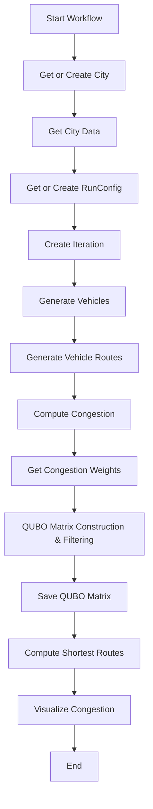

# Quantum-Inspired Traffic Optimization: A Scalable and Dynamic Approach for Congestion Minimization in Urban Environments
[[PAPER]]()

---

## Project Overview

This project simulates and optimizes urban vehicle routing to minimize congestion using a Quadratic Unconstrained Binary Optimization (QUBO) approach. It integrates real-world city data, simulates thousands of vehicles, computes congestion, and formulates a QUBO problem for quantum or classical solvers. The workflow includes data extraction, simulation, congestion analysis, optimization, and visualization.

---

## Installation

1. **Clone the repository:**
   ```bash
   git clone <repo-url>
   cd qa_mtc
   ```
2. **Install dependencies:**
   ```bash
   pip install -r requirements.txt
   ```
3. **Set up database:**
   - Ensure you have a MariaDB/MySQL instance running.
   - Update connection settings in the code or via environment variables if needed.

---

## Usage

Run the main workflow:
```bash
python src/modules/main.py
```

- Configuration parameters (city, number of vehicles, etc.) are in `src/modules/config.py`.
- Outputs (QUBO matrix, heatmaps) are saved in `src/modules/files/`.

---

## Workflow

1. **City Graph Extraction:**
   - Downloads or loads the city road network using OpenStreetMap and Google Maps APIs.
2. **Vehicle Generation:**
   - Simulates thousands of vehicles and generates alternative routes for each.
3. **Congestion Calculation:**
   - Computes pairwise congestion scores for all vehicle-route pairs.
4. **QUBO Matrix Construction:**
   - Builds a QUBO matrix encoding congestion and assignment constraints.
5. **Filtering:**
   - Selects a subset of vehicles for tractable optimization (default: top congestion scores).
6. **Visualization:**
   - Generates interactive heatmaps of congestion for different routing strategies.
7. **Optimization (optional):**
   - QUBO matrix can be solved using quantum or classical solvers (see `qa_testing.py`).

---

## Directory Structure

```
qa_mtc/
  README.md
  requirements.txt
  src/
    modules/
      main.py                # Main workflow script
      config.py              # Configuration parameters
      filter_routes_for_qubo.py # Vehicle filtering logic
      qubo_matrix.py         # QUBO construction
      ...                    # Other modules (see code)
    files/                   # Output files (QUBO, heatmaps, etc.)
  tests/                     # Unit tests (recommended)
```

---

## Testing

- Unit tests are (or will be) located in the `tests/` directory.
- To run all tests:
  ```bash
  pytest tests/
  ```
- Tests cover core logic: filtering, QUBO construction, congestion calculation, etc.

---

## Mathematical Formulation

## 1. Introduction

Efficient traffic management is essential to minimizing congestion in modern transportation systems. In this study, we formulate a binary optimization problem to assign a set of cars to predefined trases (routes), such that each car selects exactly one trase, while minimizing overall congestion caused by multiple cars sharing the same trase. We encode the problem in the form of a **Quadratic Unconstrained Binary Optimization (QUBO)** model, suitable for solving via quantum annealing or classical heuristics.

---

## 2. Problem Definition

We are given:

- `n` cars, indexed `i = 0, ..., n - 1`
- `t` trases (routes), indexed `k = 0, ..., t - 1`
- Binary decision variables `x_i^k ∈ {0, 1}`, where:
  - `x_i^k = 1` if car `i` is assigned to trase `k`
  - `x_i^k = 0` otherwise

**Assignment constraint:**  
Each car must be assigned to exactly one trase:

    ∑_{k=0}^{t-1} x_i^k = 1    for all i

We also define a congestion cost `w(i, j, k)`, representing the penalty if both cars `i` and `j` are assigned to the same trase `k`.

---

## 3. Objective Function

The total congestion cost is modeled as a quadratic function over the binary variables:

    f(x) = ∑_{k=0}^{t-1} ∑_{0 ≤ i < j < n} w(i, j, k) · x_i^k · x_j^k

This function penalizes combinations of cars assigned to the same congested trase, encouraging distribution across less crowded paths.

---

## 4. Constraint Enforcement via Penalty Term

To enforce that each car takes exactly one trase, we use a penalty function:

    P(x) = λ · ∑_{i=0}^{n-1} ( ∑_{k=0}^{t-1} x_i^k - 1 )²

Here, `λ` is a penalty coefficient that balances constraint enforcement with the minimization of congestion.

---

## 5. Full QUBO Objective

The total function to minimize becomes:

    F(x) = f(x) + P(x)

This is a fully quadratic, unconstrained objective suitable for QUBO solvers such as those provided by D-Wave.


## 6. Variable Flattening and Index Mapping

To express the problem in a QUBO matrix form, we flattened the `x_i^k` variables into a 1D binary vector `x_q` using:

    q = i · t + k

Each car-trase pair `(i, k)` is assigned a unique index `q ∈ {0, 1, ..., n·t - 1}`.  
The QUBO matrix `Q ∈ ℝ^{nt × nt}` then stores the coefficients such that:

    F(x) = xᵀ · Q · x


## 7. Algorithm: QUBO Matrix Construction

```
# Inputs:
# n = number of cars
# t = number of trases
# w[i][j][k] = congestion weight for cars i and j on trase k
# lambda_penalty = penalty coefficient

# Step 0: Compute congestion weights `w[i][j][k]`:

    - Use **OpenStreetMap** (via the `osmnx` Python library) to download the city road network graph `G_city`
    - Generate `n` car origin-destination (OD) pairs randomly within the graph boundary
    - For each car `i`, use the **Google Maps Directions API** to obtain `k = 3` alternative routes for the same OD pair
    - For each pair of cars `(i, j)` and each route index `k`, compute `w[i][j][k]` as:

        `w[i][j][k] = number of shared road segments (edges) between x_i^k and x_j^k`

    - This captures how much overlap (congestion potential) exists if both cars take the same route index `k`

# Step 1: Initialize Q as an empty dictionary

# Step 2: Congestion penalty (encourage cars to avoid same congested trase)
    for k in range(t):
        for i, j in combinations(range(n), 2):
            q1 = i * t + k
            q2 = j * t + k
            Q[(q1, q2)] += w[i][j][k]

# Step 8: Assignment constraint (each car must take exactly one trase)
    for i in range(n):
        # Linear terms from expanding (sum_k x_i^k - 1)^2
        for k in range(t):
            q = i * t + k
            Q[(q, q)] += lambda_penalty * (1 - 2)  # x^2 - 2x → +1 -2 in the expansion

        # Quadratic terms from x_i^k1 * x_i^k2
        for k1, k2 in combinations(range(t), 2):
            q1 = i * t + k1
            q2 = i * t + k2
            Q[(q1, q2)] += 2 * lambda_penalty
```

## 8. Complexity Analysis

- **Number of variables:** `N = n · t`
- **QUBO matrix size:** `O(N²)` in the dense case
- The original assignment problem has `t^n` valid solutions, making it **exponential in n**
- The QUBO formulation does **not reduce complexity** but transforms the problem into a form that can be handled by specialized solvers
- The problem remains **NP-hard**, but the QUBO structure makes it solvable using:
  - Quantum annealing (e.g., D-Wave)
  - Classical heuristics (e.g., simulated annealing, tabu search)

---

## 9. QUBO Output and Integration

The resulting dictionary `Q[(q1, q2)]` constructed using the algorithm in Section 7 represents the full QUBO matrix. This output is compatible with quantum and hybrid solvers.

For example, with **D-Wave's Ocean SDK**, you can directly load it as:

```python
from dimod import BinaryQuadraticModel

bqm = BinaryQuadraticModel.from_qubo(Q)
```

## 10. Novelty and Contribution

Existing systems such as Google Maps and Waze perform real-time routing based on individual travel time optimization. While effective for user-level navigation, these systems do not coordinate across multiple vehicles, which can lead to **unintended congestion** as many users are directed to the same route.

Classical transportation planning tools (e.g., VISUM, TransCAD) optimize traffic assignments using equilibrium models but are primarily designed for **long-term forecasting** rather than **real-time, dynamic allocation**.

In contrast, our approach formulates the **car-to-trase assignment problem** as a **Quadratic Unconstrained Binary Optimization (QUBO)** problem. The key novelties of our method include:

- **Coordinated vehicle routing** using a global objective function
- **Congestion-aware modeling** via pairwise weights `w(i, j, k)` that penalize cars assigned to the same trase
- **Constraint enforcement** through penalty terms that guarantee each car is assigned exactly one trase
- Compatibility with **quantum annealing hardware** (e.g., D-Wave), allowing execution on specialized solvers for combinatorial optimization
- Applicability to **multi-agent systems**, autonomous vehicle coordination, and real-time traffic distribution

This formulation bridges the gap between high-level traffic assignment models and real-time routing needs, offering a scalable, intelligent traffic control mechanism that is both rigorous and deployable.

## Database Schema & ORM Usage

The system uses SQLAlchemy ORM models for all database tables. The schema includes:
- **City, Node, Edge:** Graph structure of the city
- **RunConfig, Iteration:** Simulation configuration and runs
- **Vehicle, VehicleRoute, RoutePoint:** Vehicles and their possible routes
- **CongestionMap:** Pairwise congestion scores between vehicles/routes
- **QAResult:** Results of QUBO/QA optimization

**Session Management:**
- Use `from db_config import get_session` to create a session.
- Always use context managers (`with` statements) for sessions to ensure proper cleanup.

Example:
```python
from db_config import get_session
with get_session() as session:
    # ORM operations here
    ...
```

## Workflow Diagram



