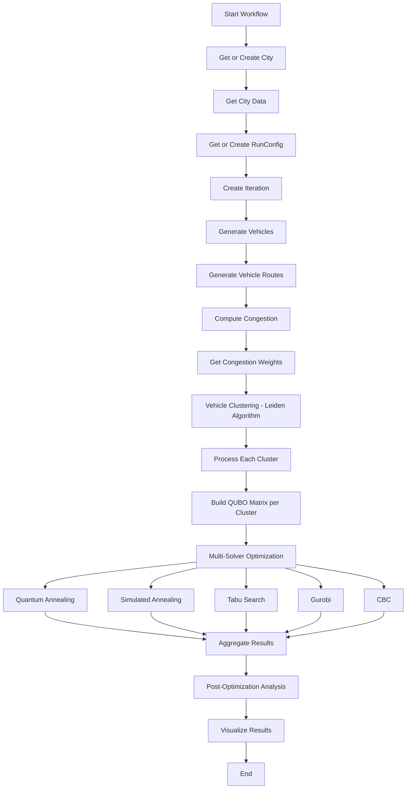

# Quantum Annealing for Realistic Traffic Flow Optimization: Clustering and Data-Driven QUBO
[[PAPER]](https://arxiv.org/pdf/2510.06053)

---

## Project Overview

This project implements the Traffic Flow Optimization (TFO) framework, which formulates the vehicle-to-route assignment problem as a Quadratic Unconstrained Binary Optimization (QUBO) model.
The objective is to assign exactly one route to each vehicle such that overall traffic congestion is minimized while avoiding inefficient route choices.

The system integrates:
- real-world routing (Valhalla + OpenStreetMap)
- spatiotemporal congestion modeling
- hybrid quantum–classical optimization

The project is written in Python and uses a MariaDB database for data storage.
Scalability is achieved through Leiden clustering and problem decomposition, rather than solving a single global QUBO instance.

---

## Installation

1. **Clone the repository:**
   ```bash
   git clone <repo-url>
   cd qa_mtc
   ```
2. **Install dependencies:**
   ```bash
   pip install -r requirements.txt
   ```
3. **Set up database:**
   - Ensure you have a MariaDB instance running (https://mariadb.org/download/).
   - Update connection settings via environment variables or directly in `src/modules/db_config.py`:
     - `DB_USER`, `DB_PASSWORD`, `DB_HOST`, `DB_NAME`
   - Tables are created automatically via `Base.metadata.create_all(engine)` in `src/modules/models.py` when the models are imported.
4. **Valhalla routing engine:**
   - Download Valhalla via Docker: https://hub.docker.com/r/valhalla/valhalla
   - Download and build map tiles: https://www.interline.io/valhalla/tilepacks/
   - Start the Valhalla service and ensure it is accessible. The HTTP endpoint is configured in `src/modules/utils.py`.

## Solver licenses & credentials (Gurobi / D-Wave)

Some solvers require a commercial license or cloud credentials:

### Gurobi (commercial)
- You must have a valid Gurobi license to run Gurobi-based optimization.
- Set up your local license (e.g., `grbgetkey`) or configure a license server per Gurobi's documentation.

### D-Wave (cloud / Leap account)
- You need a D-Wave Leap account and an API token.
- Configure credentials via the `dwave` CLI or set the environment variable:
  ```
  DWAVE_API_TOKEN=<your_token>
  ```

---

## Usage

Run the main workflow:
```bash
python src/modules/main.py
```

- Configuration parameters (city, number of vehicles, etc.) are in `src/modules/config.py`.
- Outputs are saved to runtime-generated directories (excluded from the repository via `.gitignore`):
  - `src/modules/files_csv/` — QUBO matrices and CSV results
  - `src/modules/files_html/` — interactive congestion heatmaps

---

## Configuration

Key parameters in `src/modules/config.py`:

```python
# --- Simulation/City Parameters ---
CITY_NAME = "Kosice, Slovakia"
CENTER_COORDS = (48.7208, 21.2575)
RADIUS_KM = 3.2                         # City radius for simulation
N_VEHICLES = 10000                      # Total vehicles to simulate
K_ALTERNATIVES = 3                      # Routes per vehicle
MIN_LENGTH = 500                        # Minimum route length (meters)
MAX_LENGTH = 4000                       # Maximum route length (meters)
TIME_STEP = 10                          # Time step for congestion calculation
TIME_WINDOW = 300                       # Time window for congestion calculation
DISTANCE_FACTOR = 4.0                   # Factor to adjust distance in congestion calculations

# --- Clustering Parameters ---
CLUSTER_RESOLUTION = 4.0                # Leiden algorithm resolution parameter
MIN_CLUSTER_SIZE = 500                  # Minimum vehicles per cluster
MAX_CLUSTERS = 200                      # Maximum number of clusters to process

# --- QUBO/QA Parameters ---
COMP_TYPE = "hybrid"                    # Solver type: 'sa', 'hybrid', 'hybrid_cqm', 'qpu'
ROUTE_METHOD = "duration"               # Route optimization method: "duration" or "distance"
FULL = False                            # True = run all solvers, False = QA + Gurobi only

# --- Optional Attraction Point ---
ATTRACTION_POINT = None                 # (lat, lon) tuple for attraction-based vehicle generation
D_ALTERNATIVES = None                   # Number of attraction alternatives
```

> Note: These are the current defaults in `config.py`. Adjust per experiment.

---

## Workflow

1. **City Graph Extraction:** Downloads or loads the city road network using OpenStreetMap and Valhalla APIs.
2. **Vehicle Generation:** Simulates vehicles with random or attraction-based origin/destination pairs.
3. **Route Generation (Valhalla):** Generates `K_ALTERNATIVES` alternative routes per vehicle.
4. **Congestion Calculation:** Computes pairwise congestion scores for all vehicle-route pairs based on spatiotemporal overlap.
5. **Vehicle Clustering:** Groups vehicles into clusters using the Leiden community detection algorithm, based on congestion interactions. Small clusters are merged with high-connectivity neighbors to ensure minimum cluster sizes (controlled by `MIN_CLUSTER_SIZE` and `CLUSTER_RESOLUTION`).
6. **QUBO Matrix Construction:** Builds a QUBO matrix for each cluster, encoding congestion costs and one-hot assignment constraints. Clusters are processed independently for scalability.
7. **Multi-Solver Optimization:** Solves each cluster's QUBO using one or more solvers (see [Multi-Solver Approach](#multi-solver-approach)).
8. **Assignment Extraction:** Aggregates per-cluster results into a complete vehicle-to-route assignment.
9. **Post-Optimization Congestion Analysis:** Recomputes congestion under the optimized assignments and compares results across solvers.
10. **Visualization:** Generates interactive HTML heatmaps of congestion for different routing strategies.

### Workflow Diagram


```mermaid
graph TD
    A[Start Workflow] --> B[Get or Create City]
    B --> C[Get City Data]
    C --> D[Get or Create RunConfig]
    D --> E[Create Iteration]
    E --> F[Generate Vehicles]
    F --> G[Generate Vehicle Routes]
    G --> H[Compute Congestion]
    H --> I[Get Congestion Weights]
    I --> J[Vehicle Clustering - Leiden Algorithm]
    J --> K[Process Each Cluster]
    K --> L[Build QUBO Matrix per Cluster]
    L --> M[Multi-Solver Optimization]
    M --> N[Quantum Annealing]
    M --> O[Simulated Annealing]
    M --> P[Tabu Search]
    M --> Q[Gurobi]
    M --> R[CBC]
    N --> S[Aggregate Results]
    O --> S
    P --> S
    Q --> S
    R --> S
    S --> T[Post-Optimization Analysis]
    T --> U[Visualize Results]
    U --> V[End]
```

---

## Multi-Solver Approach

The system supports multiple optimization approaches for solving QUBO problems:

### Quantum Annealing (D-Wave)
- **Hybrid BQM**: `LeapHybridSampler` for larger problems
- **Hybrid CQM**: `LeapHybridCQMSampler` with explicit constraints
- **QPU**: Direct quantum processing unit access

### Classical Solvers
- **Simulated Annealing**: `SimulatedAnnealingSampler` from D-Wave Ocean
- **Tabu Search**: `TabuSampler` for local search optimization
- **Gurobi**: Commercial MIP solver for exact solutions
- **CBC**: Open-source linear programming solver

All solvers process the same QUBO formulation per cluster. Results are stored in separate database tables for comparison. The QUBO dictionary `Q[(q1, q2)]` is compatible with D-Wave's Ocean SDK:

```python
from dimod import BinaryQuadraticModel

bqm = BinaryQuadraticModel.from_qubo(Q)
```

SQL queries in `src/sql/` provide comparative analysis across solvers.

---

## Mathematical Formulation

For full details, see the [paper](https://arxiv.org/pdf/2510.06053). A brief summary follows.

**Variables:** Binary `x_i^k ∈ {0, 1}` — vehicle `i` assigned to route `k`.

**Assignment constraint:** Each vehicle must take exactly one route:

    ∑_{k} x_i^k = 1    for all i

**Objective:** Minimize total congestion plus a route-duration penalty:

    f(x) = ∑_{i<j} ∑_{k1,k2} w[i][j][k1][k2] · x_i^{k1} · x_j^{k2}  +  ∑_{i,k} π[i,k] · x_i^k

**Penalty term** (enforcing the one-hot constraint):

    P(x) = λ · ∑_{i} ( ∑_{k} x_i^k - 1 )²

where `λ` is calculated using the Verma-Lewis row-sum principle to ensure constraint dominance.

**Full QUBO objective:**

    F(x) = f(x) + P(x)

Variables are flattened via `q = i · t + k` into a 1D vector, forming a QUBO matrix `Q ∈ ℝ^{nt × nt}`. For `hybrid_cqm` mode, the constraint is passed explicitly rather than via penalty terms.

---

## Database Schema

The system uses SQLAlchemy ORM. Tables defined in `src/modules/models.py`:

| Table | Description |
|---|---|
| `cities` | City metadata (name, radius, center coordinates) |
| `nodes` | Road network nodes (OSM IDs, coordinates) |
| `edges` | Road network edges (geometry, length) |
| `run_configs` | Simulation configuration (vehicles, routes, time params) |
| `iterations` | Individual simulation runs |
| `vehicles` | Vehicle origin/destination pairs |
| `vehicle_routes` | Alternative routes per vehicle (duration, distance) |
| `route_points` | Points along each vehicle route |
| `congestion_map` | Pairwise congestion scores between vehicle-route pairs |
| `qubo_run_stats` | QUBO matrix statistics per cluster run |
| `congestion_summary` | Per-edge congestion results for all solvers |
| `qa_results` | QUBO/QA optimization results |
| `qa_selected_routes` | Routes selected by QA optimization |
| `sa_results` | Simulated Annealing results |
| `sa_selected_routes` | Routes selected by SA |
| `tabu_results` | Tabu Search results |
| `tabu_selected_routes` | Routes selected by Tabu Search |
| `gurobi_results` | Gurobi MIP solver results |
| `gurobi_routes` | Routes selected by Gurobi |
| `cbc_results` | CBC solver results |
| `cbc_routes` | Routes selected by CBC |
| `random_routes` | Randomly assigned routes (baseline) |
| `shortest_routes_duration` | Shortest-duration routes (baseline) |
| `shortest_routes_distance` | Shortest-distance routes (baseline) |
| `objective_values` | Objective values per solver for comparison |

**Session Management:**

```python
from db_config import get_session

session = get_session()
try:
    # ORM operations here
    session.commit()
finally:
    session.close()
```

---

## Directory Structure

```
qa_mtc/
  README.md
  requirements.txt
  LICENSE
  images/                           # Result images and plots
  maps/                             # Interactive HTML maps (figures from paper)
  src/
      modules/
         main.py                    # Main workflow script
         main_full.py               # Variant running all solvers
         config.py                  # Configuration parameters
         models.py                  # SQLAlchemy ORM models
         db_config.py               # Database connection setup
         qubo_matrix.py             # QUBO construction
         filter_routes_for_qubo.py  # Vehicle filtering logic
         process_clusters.py        # Cluster processing (QA + Gurobi)
         process_clusters_full.py   # Cluster processing (all solvers)
         qa_testing.py              # Quantum/hybrid solver integration
         sa_testing.py              # Simulated Annealing solver
         tabu_testing.py            # Tabu Search solver
         gurobi_testing.py          # Gurobi solver
         cbc_testing.py             # CBC solver
         congestion_weights.py      # Congestion weight computation
         get_congestion_weights.py  # DB retrieval of congestion weights
         generate_congestion.py     # Congestion generation utilities
         utils.py                   # Shared utilities (Valhalla client, etc.)
         analyzes.ipynb             # Analysis notebook
         ...                        # Additional helper modules
      sql/                          # SQL queries for comparative analysis
```

> Note: Runtime output directories (`files_csv/`, `files_html/`) are generated locally and excluded from the repository via `.gitignore`.

---

## License

See [LICENSE](LICENSE).
