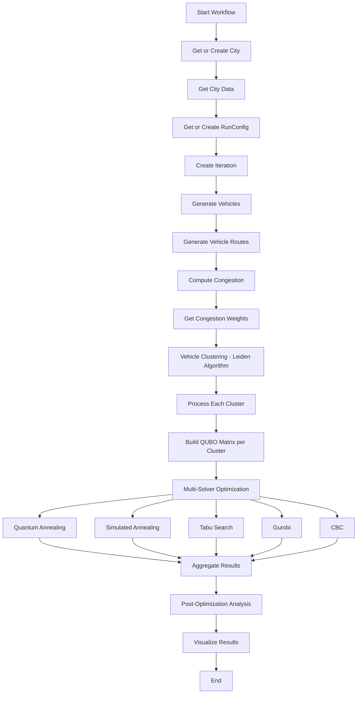

# Quantum-Inspired Traffic Optimization: A Scalable and Dynamic Approach for Congestion Minimization in Urban Environments
[[PAPER]](https://arxiv.org/pdf/2510.06053)

---

## Project Overview

This project simulates and optimizes urban vehicle routing to minimize congestion using a Quadratic Unconstrained Binary Optimization (QUBO) approach. It integrates real-world city data, simulates thousands of vehicles, computes congestion, and formulates a QUBO problem for quantum or classical solvers. The workflow includes data extraction, simulation, congestion analysis, optimization, and visualization.

---

## Installation

1. **Clone the repository:**
   ```bash
   git clone <repo-url>
   cd qa_mtc
   ```
2. **Install dependencies:**
   ```bash
   pip install -r requirements.txt
   ```
3. **Set up database:**
   - Ensure you have a MariaDB/MySQL instance running.
   - Update connection settings in the code or via environment variables if needed.

---

## Usage

Run the main workflow:
```bash
python src/modules/main.py
```

- Configuration parameters (city, number of vehicles, etc.) are in `src/modules/config.py`.
- Outputs (QUBO matrix, heatmaps) are saved in `src/modules/files/`.

---

## Workflow

1. **City Graph Extraction:**
   - Downloads or loads the city road network using OpenStreetMap and Valhalla APIs.
2. **Vehicle Generation:**
   - Simulates thousands of vehicles and generates alternative routes for each.
3. **Route Generation (Valhalla):**
   - Generates multiple alternative routes per vehicle using the Valhalla routing engine.
4. **Congestion Calculation:**
   - Computes pairwise congestion scores for all vehicle-route pairs based on spatiotemporal overlap.
5. **Vehicle Clustering:**
   - Groups vehicles by connectivity using the Leiden community detection algorithm.
   - Creates clusters based on congestion interactions between vehicles.
   - Ensures minimum cluster sizes by merging small clusters with neighbors.
6. **QUBO Matrix Construction:**
   - Builds a QUBO matrix for each cluster separately, encoding congestion and assignment constraints.
   - Processes clusters in parallel, making the optimization scalable for large vehicle fleets.
7. **Multi-Solver Optimization:**
   - Solves each cluster's QUBO using multiple approaches:
     - **Quantum Annealing**: D-Wave quantum computers (hybrid, CQM, QPU modes)
     - **Classical Solvers**: Simulated Annealing, Tabu Search, Gurobi, CBC
   - Compares performance across different solution methods.
8. **Assignment Extraction:**
   - Extracts the optimal or near-optimal assignment from each solver's solution.
   - Aggregates results across all clusters to form the complete vehicle assignment.
9. **Post-Optimization Congestion Analysis:**
   - Recomputes congestion based on the optimized assignments from different solvers.
   - Compares congestion reduction achieved by each method.
10. **Visualization:**
    - Generates interactive heatmaps of congestion for different routing strategies.
    - Visualizes cluster distributions and optimization results.

**Workflow Diagram (textual):**
```
[City Graph] → [Vehicles] → [Routes] → [Congestion] → [QUBO Matrix]
      ↓                                         ↑
[Filtering] → [QUBO/QA Optimization] → [Assignment] → [Post-QA Congestion] → [Visualization]
```

---

## Directory Structure

```
qa_mtc/
  README.md
  requirements.txt
  src/
    modules/
      main.py                # Main workflow script
      config.py              # Configuration parameters
      filter_routes_for_qubo.py # Vehicle filtering logic
      qubo_matrix.py         # QUBO construction
      ...                    # Other modules (see code)
    files/                   # Output files (QUBO, heatmaps, etc.)
  tests/                     # Unit tests (recommended)
```

---

## Testing

- Unit tests are (or will be) located in the `tests/` directory.
- To run all tests:
  ```bash
  pytest tests/
  ```
- Tests cover core logic: filtering, QUBO construction, congestion calculation, etc.

---

## Multi-Solver Approach

The system supports multiple optimization approaches for solving QUBO problems:

### Quantum Annealing (D-Wave)
- **Hybrid**: `LeapHybridSampler` for larger problems
- **CQM**: `LeapHybridCQMSampler` with explicit constraints
- **QPU**: Direct quantum processing unit access

### Classical Solvers
- **Simulated Annealing**: `SimulatedAnnealingSampler` from D-Wave Ocean
- **Tabu Search**: `TabuSampler` for local search optimization
- **Gurobi**: Commercial MIP solver for exact solutions
- **CBC**: Open-source linear programming solver

### Performance Comparison
- All solvers process the same QUBO formulation per cluster
- Results are stored in separate database tables for analysis
- Execution times, solution quality, and energy values are tracked
- SQL queries in `sql/` directory provide comparative analysis

---

## Mathematical Formulation

## 1. Introduction

Efficient traffic management is essential to minimizing congestion in modern transportation systems. In this study, we formulate a binary optimization problem to assign a set of cars to predefined routes, such that each car selects exactly one route, while minimizing overall congestion caused by multiple cars sharing the same route. We encode the problem in the form of a **Quadratic Unconstrained Binary Optimization (QUBO)** model, suitable for solving via quantum annealing or classical heuristics.

---

## 2. Problem Definition

We are given:

- `n` vehicles, indexed `i = 0, ..., n - 1`
- `t` routes (alternatives), indexed `k = 0, ..., t - 1`
- Binary decision variables `x_i^k ∈ {0, 1}`, where:
  - `x_i^k = 1` if vehicle `i` is assigned to route `k`
  - `x_i^k = 0` otherwise

**Assignment constraint:**  
Each vehicle must be assigned to exactly one route:

    ∑_{k=0}^{t-1} x_i^k = 1    for all i

We also define a congestion cost `w[i][j][k1][k2]`, representing the penalty if vehicle `i` is assigned to route `k1` and vehicle `j` to route `k2`.

---

## 3. Objective Function

The total congestion cost is modeled as a quadratic function over the binary variables:

    f(x) = ∑_{i=0}^{n-1} ∑_{j=0}^{n-1} ∑_{k1=0}^{t-1} ∑_{k2=0}^{t-1} w[i][j][k1][k2] · x_i^{k1} · x_j^{k2}

This function penalizes combinations of vehicles assigned to congested route pairs, encouraging distribution across less crowded paths.

---

## 4. Constraint Enforcement via Penalty Term

To enforce that each vehicle is assigned exactly one route, we use a penalty function:

    P(x) = λ · ∑_{i=0}^{n-1} ( ∑_{k=0}^{t-1} x_i^k - 1 )²

Here, `λ` is a penalty coefficient that balances constraint enforcement with the minimization of congestion.

---

## 5. Full QUBO Objective

The total function to minimize becomes:

    F(x) = f(x) + P(x)

This is a fully quadratic, unconstrained objective suitable for QUBO solvers such as those provided by D-Wave.

---

## 6. Variable Flattening and Index Mapping

To express the problem in a QUBO matrix form, we flatten the `x_i^k` variables into a 1D binary vector `x_q` using:

    q = i · t + k

Each vehicle-route pair `(i, k)` is assigned a unique index `q ∈ {0, 1, ..., n·t - 1}`.  
The QUBO matrix `Q ∈ ℝ^{nt × nt}` then stores the coefficients such that:

    F(x) = xᵀ · Q · x

---

## 7. Algorithm: QUBO Matrix Construction

- **Step 1:** Filter vehicles for QUBO (e.g., by congestion impact).
- **Step 2:** Compute or normalize congestion weights `w[i][j][k1][k2]` for the filtered set.
- **Step 3:** For all pairs `(i, j)` and route pairs `(k1, k2)`, set QUBO matrix entries:
    - `Q[(q1, q2)] += w[i][j][k1][k2]` for off-diagonal terms.
- **Step 4:** For each vehicle, add assignment constraint terms:
    - `Q[(q, q)] += λ · (1 - 2)` for linear terms.
    - `Q[(q1, q2)] += 2λ` for all pairs of routes for the same vehicle.

---

## 8. Complexity Analysis

### Without Clustering
- **Number of variables:** `N = n · t` (all vehicles × routes)
- **QUBO matrix size:** `O(N²)` in the dense case
- **Problem size:** Exponential in number of vehicles

### With Clustering
- **Number of clusters:** `C` (typically `C << n`)
- **Variables per cluster:** `N_c = n_c · t` (cluster vehicles × routes)
- **Total complexity:** `O(∑(N_c²))` where `∑N_c = N`
- **Parallel processing:** Clusters solved independently
- **Scalability improvement:** Linear scaling with number of clusters

### Benefits
- **Memory efficiency:** Smaller QUBO matrices per cluster
- **Solution quality:** Maintains optimization quality within high-interaction groups
- **Computational speed:** Parallel cluster processing
- **Hardware compatibility:** Fits within quantum annealer limits

---

## 9. QUBO Output and Integration

The resulting dictionary `Q[(q1, q2)]` constructed using the algorithm in Section 7 represents the full QUBO matrix. This output is compatible with quantum and hybrid solvers.

For example, with **D-Wave's Ocean SDK**, you can directly load it as:

```python
from dimod import BinaryQuadraticModel

bqm = BinaryQuadraticModel.from_qubo(Q)
```

---

## 10. Novelty and Contribution

Existing systems such as Google Maps and Waze perform real-time routing based on individual travel time optimization. While effective for user-level navigation, these systems do not coordinate across multiple vehicles, which can lead to **unintended congestion** as many users are directed to the same route.

Classical transportation planning tools (e.g., VISUM, TransCAD) optimize traffic assignments using equilibrium models but are primarily designed for **long-term forecasting** rather than **real-time, dynamic allocation**.

In contrast, our approach formulates the **vehicle-to-route assignment problem** as a **Quadratic Unconstrained Binary Optimization (QUBO)** problem. The key novelties of our method include:

- **Coordinated vehicle routing** using a global objective function
- **Congestion-aware modeling** via pairwise weights `w[i][j][k1][k2]` that penalize vehicles assigned to congested route pairs
- **Constraint enforcement** through penalty terms that guarantee each vehicle is assigned exactly one route
- Compatibility with **quantum annealing hardware** (e.g., D-Wave), allowing execution on specialized solvers for combinatorial optimization
- Applicability to **multi-agent systems**, autonomous vehicle coordination, and real-time traffic distribution

This formulation bridges the gap between high-level traffic assignment models and real-time routing needs, offering a scalable, intelligent traffic control mechanism that is both rigorous and deployable.

## Database Schema & ORM Usage

The system uses SQLAlchemy ORM models for all database tables. The schema includes:
- **City, Node, Edge:** Graph structure of the city
- **RunConfig, Iteration:** Simulation configuration and runs
- **Vehicle, VehicleRoute, RoutePoint:** Vehicles and their possible routes
- **CongestionMap:** Pairwise congestion scores between vehicles/routes
- **QAResult:** Results of QUBO/QA optimization

**Session Management:**
- Use `from db_config import get_session` to create a session.
- Always use context managers (`with` statements) for sessions to ensure proper cleanup.

Example:
```python
from db_config import get_session
with get_session() as session:
    # ORM operations here
    ...
```

## Workflow Diagram


```mermaid
graph TD
    A[Start Workflow] --> B[Get or Create City]
    B --> C[Get City Data]
    C --> D[Get or Create RunConfig]
    D --> E[Create Iteration]
    E --> F[Generate Vehicles]
    F --> G[Generate Vehicle Routes]
    G --> H[Compute Congestion]
    H --> I[Get Congestion Weights]
    I --> J[Vehicle Clustering - Leiden Algorithm]
    J --> K[Process Each Cluster]
    K --> L[Build QUBO Matrix per Cluster]
    L --> M[Multi-Solver Optimization]
    M --> N[Quantum Annealing]
    M --> O[Simulated Annealing]
    M --> P[Tabu Search]
    M --> Q[Gurobi]
    M --> R[CBC]
    N --> S[Aggregate Results]
    O --> S
    P --> S
    Q --> S
    R --> S
    S --> T[Post-Optimization Analysis]
    T --> U[Visualize Results]
    U --> V[End]
```

## Vehicle Clustering Algorithm

The system implements an intelligent clustering approach to make QUBO optimization scalable for large vehicle fleets:

### Leiden Community Detection
- Uses the **Leiden algorithm** to detect communities in the vehicle congestion network
- Vehicles are nodes, congestion interactions are weighted edges
- Resolution parameter controls cluster granularity (configurable via `CLUSTER_RESOLUTION`)

### Cluster Processing
- **`get_clusters_by_connectivity()`**: Groups vehicles by total congestion interaction
- **`merge_small_clusters()`**: Ensures minimum cluster sizes by merging small clusters with high-connectivity neighbors
- **Parallel Processing**: Each cluster is optimized independently, enabling scalability

### Benefits
- **Scalability**: Breaks O(n²) problems into multiple smaller sub-problems
- **Quality**: Maintains optimization quality by preserving high-interaction vehicle groups
- **Flexibility**: Supports different minimum cluster sizes and resolution parameters

---

# Clustering and Filtering
          # Vehicle clustering logic (Leiden algorithm)
                # Process clusters (QA + Gurobi)
           # Process clusters (all solvers)
  
  # QUBO Construction
                     # QUBO matrix construction per cluster
  congestion_weights.py            # Congestion weight calculations
  
  # Solvers
                      # Quantum Annealing (D-Wave)
                      # Simulated Annealing
                    # Tabu Search
                  # Gurobi optimization
                     # CBC solver
  
  # Other modules
                          # Database models
  generate_*.py                    # Vehicle and route generation
  ...                              # Other utility modules
files_csv/                         # QUBO matrices output
files_html/                        # Visualization heatmaps

---

## Configuration

Key parameters in `src/modules/config.py`:

```python
# Clustering Parameters
CLUSTER_RESOLUTION = 4.0          # Leiden algorithm resolution
MIN_CLUSTER_SIZE = 100            # Minimum vehicles per cluster
MAX_CLUSTERS = None               # Limit number of clusters (None = all)

# Solver Selection
COMP_TYPE = "hybrid"              # QA solver type
FULL = False                      # True = run all solvers, False = QA + Gurobi only

# Vehicle Generation
N_VEHICLES = 18000                # Total vehicles to simulate
K_ALTERNATIVES = 3                # Routes per vehicle
```


[definitionLink]: https://arxiv.org/pdf/2510.06053