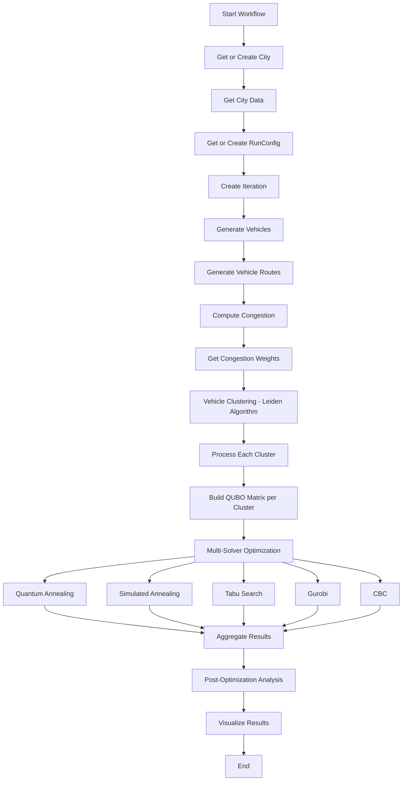

# Quantum Annealing for Realistic Traffic Flow Optimization: Clustering and Data-Driven QUBO
[[PAPER]](https://arxiv.org/pdf/2510.06053)

---

## Project Overview

This project implements the Traffic Flow Optimization (TFO) framework, which formulates the vehicle-to-route assignment problem as a Quadratic Unconstrained Binary Optimization (QUBO) model.
The objective is to assign exactly one route to each vehicle such that overall traffic congestion is minimized while avoiding inefficient route choices.

The system integrates:
- real-world routing (Valhalla + OpenStreetMap)
- spatiotemporal congestion modeling
- hybrid quantum–classical optimization

The project is written in Python and is using MariaDB database as a data storage.
Scalability is achieved through Leiden clustering and problem decomposition, rather than solving a single global QUBO instance.

---

## Installation

1. **Clone the repository:**
   ```bash
   git clone <repo-url>
   cd qa_mtc
   ```
2. **Install dependencies:**
   ```bash
   pip install -r requirements.txt
   ```
3. **Set up database:**
   - Ensure you have a MariaDB instance running (https://mariadb.org/download/).
   - Update connection settings in the code or via environment variables if needed (setup in src/modules/db_config.py).
   - Tables are created via SQLAlchemy Base.metadata.create_all(engine) in src/modules/models.py when the models are imported
4. **Valhalla engine**
   - Download Valhalla via docker https://hub.docker.com/r/valhalla/valhalla and run it
   - Download and build map tiles (https://www.interline.io/valhalla/tilepacks/)
   - Start the Valhalla service and ensure it is accessible  (Valhalla HTTP endpoint is set in /src/modules/utils.py)


## Solver licenses & credentials (Gurobi / D-Wave)

Some solvers used in this project require a commercial license or cloud credentials:

### Gurobi (commercial)
This project can use **Gurobi** via the `gurobipy` Python package.

- You must have a valid Gurobi license to run Gurobi-based optimization.
- Set up your local license (e.g., `grbgetkey`) or configure a license server according to Gurobi’s documentation.


### D-Wave (cloud / Leap account)
This project can use **D-Wave Ocean** (`dwave_system`) for hybrid solvers / quantum annealing.

- You need a D-Wave Leap account and an API token.
- Configure credentials using Ocean’s standard configuration (recommended), e.g. via the `dwave` CLI, or set the environment variable:
  - `DWAVE_API_TOKEN=<your_token>`

  

---

## Usage

Run the main workflow:
```bash
python src/modules/main.py
```

- Configuration parameters (city, number of vehicles, etc.) are in `src/modules/config.py`.
- Outputs are saved in (because of size limits in .gitignore - could be added):
   - `src/modules/files_csv/` (QUBO matrices and CSV results)
   - `src/modules/files_html/` (interactive congestion heatmaps)

---

## Configuration

Key parameters in `src/modules/config.py`:

```python
# --- Simulation/City Parameters ---
CITY_NAME = "Kosice, Slovakia"
CENTER_COORDS = (48.7208, 21.2575)
RADIUS_KM = 3.0                         # City radius for simulation
N_VEHICLES = 10000                      # Total vehicles to simulate
K_ALTERNATIVES = 3                      # Routes per vehicle
MIN_LENGTH = 500                        # Minimum route length (meters)
MAX_LENGTH = 4000                       # Maximum route length (meters)
TIME_STEP = 10                          # Time step for congestion calculation
TIME_WINDOW = 300                       # Time window for congestion calculation
DISTANCE_FACTOR = 4.0                   # Factor to adjust distance in congestion calculations

# --- Clustering Parameters ---
CLUSTER_RESOLUTION = 4.0                # Leiden algorithm resolution parameter
MIN_CLUSTER_SIZE = 500                  # Minimum vehicles per cluster
MAX_CLUSTERS = 200                      # Maximum number of clusters to process

# --- QUBO/QA Parameters ---
COMP_TYPE = "hybrid"                    # QA solver type: 'sa', 'hybrid', 'hybrid_cqm', 'qpu'
ROUTE_METHOD = "duration"               # Route optimization method: "duration" or "distance"
FULL = False                            # True = run all solvers, False = QA + Gurobi only

# --- Optional Attraction Point ---
ATTRACTION_POINT = None                 # (lat, lon) tuple for attraction-based vehicle generation
D_ALTERNATIVES = None                   # Number of attraction alternatives
```

> Note: These are current defaults in `config.py`. Change them per experiment.

---

## Workflow

1. **City Graph Extraction:**
   - Downloads or loads the city road network using OpenStreetMap and Valhalla APIs.
2. **Vehicle Generation:**
   - Simulates thousands of vehicles and generates alternative routes for each.
3. **Route Generation (Valhalla):**
   - Generates multiple alternative routes per vehicle using the Valhalla routing engine.
4. **Congestion Calculation:**
   - Computes pairwise congestion scores for all vehicle-route pairs based on spatiotemporal overlap.
5. **Vehicle Clustering:**
   - Groups vehicles by connectivity using the Leiden community detection algorithm.
   - Creates clusters based on congestion interactions between vehicles.
   - Ensures minimum cluster sizes by merging small clusters with neighbors.
6. **QUBO Matrix Construction:**
   - Builds a QUBO matrix for each cluster separately, encoding congestion and assignment constraints.
   - Processes clusters in parallel, making the optimization scalable for large vehicle fleets.
7. **Multi-Solver Optimization:**
   - Solves each cluster's QUBO using multiple approaches:
     - **Quantum Annealing**: D-Wave quantum computers (hybrid BQM, CQM, QPU modes)
     - **Classical Solvers**: Simulated Annealing, Tabu Search, Gurobi, CBC
   - Compares performance across different solution methods.
8. **Assignment Extraction:**
   - Extracts the optimal or near-optimal assignment from each solver's solution.
   - Aggregates results across all clusters to form the complete vehicle assignment.
9. **Post-Optimization Congestion Analysis:**
   - Recomputes congestion based on the optimized assignments from different solvers.
   - Compares congestion reduction achieved by each method.
10. **Visualization:**
    - Generates interactive heatmaps of congestion for different routing strategies.
    - Visualizes cluster distributions and optimization results.

## Workflow Diagram


```mermaid
graph TD
    A[Start Workflow] --> B[Get or Create City]
    B --> C[Get City Data]
    C --> D[Get or Create RunConfig]
    D --> E[Create Iteration]
    E --> F[Generate Vehicles]
    F --> G[Generate Vehicle Routes]
    G --> H[Compute Congestion]
    H --> I[Get Congestion Weights]
    I --> J[Vehicle Clustering - Leiden Algorithm]
    J --> K[Process Each Cluster]
    K --> L[Build QUBO Matrix per Cluster]
    L --> M[Multi-Solver Optimization]
    M --> N[Quantum Annealing]
    M --> O[Simulated Annealing]
    M --> P[Tabu Search]
    M --> Q[Gurobi]
    M --> R[CBC]
    N --> S[Aggregate Results]
    O --> S
    P --> S
    Q --> S
    R --> S
    S --> T[Post-Optimization Analysis]
    T --> U[Visualize Results]
    U --> V[End]
```

---

## Directory Structure

```
qa_mtc/
  README.md
  requirements.txt
  LICENSE
  src/
      bib/                          # Research notebooks
      modules/
         main.py                   # Main workflow script
         config.py                 # Configuration parameters
         filter_routes_for_qubo.py # Vehicle filtering logic
         qubo_matrix.py            # QUBO construction
         files_csv/                # CSV outputs
         files_html/               # HTML visualizations
         qubo_matrices/            # Stored matrix artifacts
         output/                   # Generated outputs
         cache/                    # Cached route/API data
         ...                       # Other modules (see code)
      sql/                         # Analysis queries
```

---


## Multi-Solver Approach

The system supports multiple optimization approaches for solving QUBO problems:

### Quantum Annealing (D-Wave)
- **Hybrid BQM**: `LeapHybridBQMSampler` for larger problems
- **Hyrid CQM**: `LeapHybridCQMSampler` with explicit constraints
- **QPU**: Direct quantum processing unit access

### Classical Solvers
- **Simulated Annealing**: `SimulatedAnnealingSampler` from D-Wave Ocean
- **Tabu Search**: `TabuSampler` for local search optimization
- **Gurobi**: Commercial MIP solver for exact solutions
- **CBC**: Open-source linear programming solver

### Performance Comparison
- All solvers process the same QUBO formulation per cluster
- Results are stored in separate database tables for analysis
- Execution times, solution quality, and energy values are tracked
- SQL queries in `sql/` directory provide comparative analysis

---

## Mathematical Formulation

## 1. Introduction

Efficient traffic management is essential to minimizing congestion in modern transportation systems. In this study, we formulate a binary optimization problem to assign a set of cars to predefined routes, such that each car selects exactly one route, while minimizing overall congestion caused by multiple cars sharing the same route also with respect to the shortest (duration) alternative. We encode the problem in the form of a **Quadratic Unconstrained Binary Optimization (QUBO)** model, suitable for solving via quantum annealing or classical heuristics.

---

## 2. Problem Definition

We are given:

- `n` vehicles, indexed `i = 0, ..., n - 1`
- `t` routes (alternatives), indexed `k = 0, ..., t - 1`
- Binary decision variables `x_i^k ∈ {0, 1}`, where:
  - `x_i^k = 1` if vehicle `i` is assigned to route `k`
  - `x_i^k = 0` otherwise

**Assignment constraint:**  
Each vehicle must be assigned to exactly one route:

    ∑_{k=0}^{t-1} x_i^k = 1    for all i

We also define a congestion cost `w[i][j][k1][k2]`, representing the penalty if vehicle `i` is assigned to route `k1` and vehicle `j` to route `k2`.

---

## 3. Objective Function

The total congestion cost is modeled as a quadratic function over the binary variables:

    f(x) = ∑_{i<j}^{n-1} ∑_{k1=0}^{t-1} ∑_{k2=0}^{t-1} w[i][j][k1][k2] · x_i^{k1} · x_j^{k2} + ∑_{i=0}^{n-1} ∑_{k=0}^{t-1} π[i,k] · x_i^{k}
    
Where:
- w[i][j][k1][k2] = congestion cost between vehicles
- π[i,k] = route duration penalty

This objective balances:
- minimizing congestion
- avoiding unnecessarily long routes

---

## 4. Constraint Enforcement via Penalty Term

To enforce that each vehicle is assigned exactly one route, we use a penalty function:

    P(x) = λ · ∑_{i=0}^{n-1} ( ∑_{k=0}^{t-1} x_i^k - 1 )²

Here, `λ` is a penalty coefficient that balances constraint enforcement with the minimization of congestion caluclated using Verma-Lewis row-sum principle.

---

## 5. Full QUBO Objective

The total function to minimize becomes:

    F(x) = f(x) + P(x)

This is a fully quadratic, unconstrained objective suitable for QUBO solvers such as those provided by D-Wave.

---

## 6. Variable Flattening and Index Mapping

To express the problem in a QUBO matrix form, we flatten the `x_i^k` variables into a 1D binary vector `x_q` using:

    q = i · t + k

Each vehicle-route pair `(i, k)` is assigned a unique index `q ∈ {0, 1, ..., n·t - 1}`.  
The QUBO matrix `Q ∈ ℝ^{nt × nt}` then stores the coefficients such that:

    F(x) = xᵀ · Q · x

---

## 7. Algorithm: QUBO Matrix Construction

The QUBO matrix construction follows these steps:

- **Step 1:** **Vehicle Filtering and Indexing**
  - Work with filtered vehicles from the cluster: `vehicle_ids_filtered`
  - Create mappings: `vehicle_id_to_idx` and `route_id_to_idx`
  - Initialize QUBO matrix `Q` as `defaultdict(float)`

- **Step 2:** **Congestion Weight Computation**
  - Call `congestion_weights()` to compute 4D weights `w[i][j][k1][k2]`
  - Extract duration penalties from `duration_penalty_df` for each vehicle-route pair

- **Step 3:** **Objective Function Terms**
  - For all vehicle pairs `(i, j)` where `i < j` (upper triangular):
    - For all route pairs `(k1, k2)`:
      - Compute flattened indices: `q1 = i * route_alternatives + k1`, `q2 = j * route_alternatives + k2`
      - Add congestion: `Q[(q1, q2)] += congestion_w[i][j][k1][k2]`

- **Step 4:** **Dynamic Penalty Calculation**
  - For each variable `q`, compute dynamic penalty based on row/column sums in QUBO
  - Calculate `lambda_penalty = max(dynamic_penalties)` to ensure constraint dominance

- **Step 5:** **One-Hot Constraint Enforcement** (if `comp_type != "hybrid_cqm"`):
  - **Diagonal terms**: `Q[(q, q)] += -lambda_penalty + penalties[q]` 
  - **Off-diagonal terms**: For same vehicle different routes: `Q[(q1, q2)] += lambda_penalty`
  - This implements the penalty: `λ * (Σ x_i^k - 1)²`

**Key Implementation Details:**
- Handles invalid routes by penalizing them heavily
- Dynamic penalty ensures constraints are stronger than objective terms
- For CQM mode, constraints are handled separately (no penalty terms added to QUBO)
---

## 8. Complexity Analysis

### Without Clustering
- **Number of variables:** `N = n · t` (all vehicles × routes)
- **QUBO matrix size:** `O(N²)` in the dense case
- **Problem size:** Exponential in number of vehicles

### With Clustering
- **Number of clusters:** `C` (typically `C << n`)
- **Variables per cluster:** `N_c = n_c · t` (cluster vehicles × routes)
- **Total complexity:** `O(∑(N_c²))` where `∑N_c = N`
- **Parallel processing:** Clusters solved independently
- **Scalability improvement:** Linear scaling with number of clusters

### Benefits
- **Memory efficiency:** Smaller QUBO matrices per cluster
- **Solution quality:** Maintains optimization quality within high-interaction groups
- **Computational speed:** Parallel cluster processing
- **Hardware compatibility:** Fits within quantum annealer limits

---

## 9. QUBO Output and Integration

The resulting dictionary `Q[(q1, q2)]` constructed using the algorithm in Section 7 represents the full QUBO matrix. This output is compatible with quantum and hybrid solvers.

For example, with **D-Wave's Ocean SDK**, you can directly load it as:

```python
from dimod import BinaryQuadraticModel

bqm = BinaryQuadraticModel.from_qubo(Q)
```

---

## Database Schema & ORM Usage

The system uses SQLAlchemy ORM models for all database tables. The schema includes:
- **City, Node, Edge:** Graph structure of the city
- **RunConfig, Iteration:** Simulation configuration and runs
- **Vehicle, VehicleRoute, RoutePoint:** Vehicles and their possible routes
- **CongestionMap:** Pairwise congestion scores between vehicles/routes
- **QAResult:** Results of QUBO/QA optimization

**Session Management:**
- Use `from db_config import get_session` to create a session.
- Always use context managers (`with` statements) for sessions to ensure proper cleanup.

Example:
```python
from db_config import get_session
with get_session() as session:
    # ORM operations here
    ...
```


## Vehicle Clustering Algorithm

The system implements an intelligent clustering approach to make QUBO optimization scalable for large vehicle fleets:

### Leiden Community Detection
- Uses the **Leiden algorithm** to detect communities in the vehicle congestion network
- Vehicles are nodes, congestion interactions are weighted edges
- Resolution parameter controls cluster granularity (configurable via `CLUSTER_RESOLUTION`)

### Cluster Processing
- **`get_clusters_by_connectivity()`**: Groups vehicles by total congestion interaction
- **`merge_small_clusters()`**: Ensures minimum cluster sizes by merging small clusters with high-connectivity neighbors
- **Parallel Processing**: Each cluster is optimized independently, enabling scalability

### Benefits
- **Scalability**: Breaks O(n²) problems into multiple smaller sub-problems
- **Quality**: Maintains optimization quality by preserving high-interaction vehicle groups
- **Flexibility**: Supports different minimum cluster sizes and resolution parameters

---


[definitionLink]: https://arxiv.org/pdf/2510.06053
